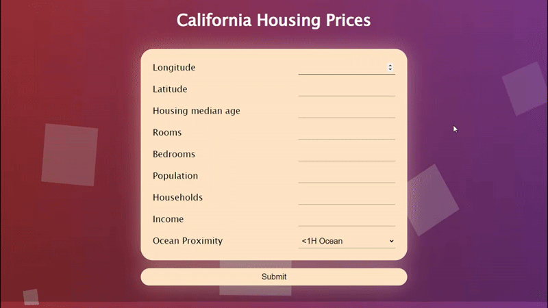

# California Housing Prices

This project is a web application that predicts housing prices in California based on various parameters. It integrates a machine learning model trained on historical housing data to provide accurate predictions.

The data contains information from the 1990 California census. So although it may not help you with predicting current housing prices like the Zillow Zestimate dataset, it does provide an accessible introductory dataset for teaching people about the basics of machine learning.

## Features

- **User-friendly Interface**: The web app features an intuitive user interface for users to input parameters and view predicted housing prices.
- **Real-time Predictions**: The machine learning model provides real-time predictions, allowing users to instantly see estimated housing prices.
- **Integration**: The machine learning model is seamlessly integrated into the web app, providing a cohesive user experience.

## Usage

If you want to run the application locally use following steps -

- git clone `https://github.com/darthdaenerys/California-Housing-Prices.git`
- Download `house_price_model.h5` from [Google Drive](https://drive.google.com/file/d/1zt2qtvvsND2_wY3PAmXgw9yTWQLV6JpE/view?usp=sharing)
- Move the downloaded `house_price_model.h5` file into the models folder within the cloned repository.
- Navigate to the project directory: `cd California-Housing-Prices`
- Install Python dependencies: `pip install -r requirements.txt`
- Install Node.js dependencies: `npm install`
- Start the server: `node server.js` and open [http://localhost](http://localhost) on your browser

## Contributing

If you would like to contribute to this project, you can fork the repository and submit a pull request with your changes. Please make sure to test your changes thoroughly before submitting the pull request.

***Thanks for visiting!***
